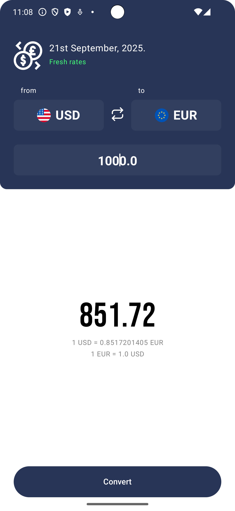

<p align="center">

<h1 align="center">Currency Exchange KMP</h1>
<p align="center">
A Kotlin Multiplatform app for checking the latest currency exchange rates.
</p>
</p>

Currency Exchange KMP is a simple app that allows you to check the latest exchange rates for various currencies. The app is built with Kotlin Multiplatform and Compose Multiplatform, targeting Android and iOS.


## Table of Contents

1.  [Screenshots](#-screenshots)
2.  [Features](#-features)
3.  [Built With](#-built-with)
4.  [Architecture](#️-architecture)
5.  [Package Structure](#-package-structure)
6.  [Installation](#️-installation)
7.  [Contributing](#-contributing)
8.  [License](#-license)

---

## 📸 Screenshots

Explore the app through these stunning visuals!

<table>
  <tr>
     <th align="center">Main Page</th>
  </tr>

  <tr>
    <td>
        
    </td>
  </tr>

 </table>

## 🌟 Features

-   **Real-time Exchange Rates:** Get the latest currency exchange rates from a reliable API.
-   **Currency Conversion:** Convert any amount from one currency to another.
-   **Offline Support:** Access the latest fetched rates even when you're offline, thanks to local caching with Realm.
-   **Cross-Platform:** Works on both Android and iOS with a shared codebase.

## 🛠 Built With

<p align="center">
Explore the technology stack that powers Currency Exchange KMP!
</p>

* **[Kotlin Multiplatform](https://kotlinlang.org/docs/multiplatform-get-started.html)** - For sharing code between Android and iOS.
* **[Jetpack Compose](https://developer.android.com/jetpack/compose)** - For building the UI for both Android and iOS.
* **[Ktor](https://ktor.io/)** - For making network requests to the currency exchange API.
* **[Realm](https://realm.io/)** - For caching data locally.
* **[Voyager](https://voyager.adriel.cafe/)** - A multiplatform navigation library for Compose.
* **[Koin](https://insert-koin.io/)** - A lightweight dependency injection framework.
* **[Coroutines](https://kotlinlang.org/docs/coroutines-overview.html)** and **[Flow](https://kotlin.github.io/kotlinx.coroutines/kotlinx-coroutines-core/kotlinx.coroutines.flow/-flow/)** - For asynchronous programming.

## 🏛️ Architecture

This app is based on the **MVVM (Model-View-ViewModel)** architecture and the repository pattern.

## 📦 Package Structure
```
com.example.currency_kmp   # Root Package
│
├── data                  # Data layer
│   ├── local             # Local data sources (Realm, Preferences)
│   └── remote            # Remote data source (Ktor API service)
│
├── domain                # Domain layer
│   ├── model             # Data models and currency codes
│   └── repository        # Repository interfaces
│
├── presentation          # Presentation layer
│   ├── component         # Reusable UI components
│   └── screen            # Screens and ViewModels
│
├── di                    # Dependency injection setup (Koin)
│
└── ui                    # UI-related files
└── theme             # App theme and colors
```

## ⬇️ Installation

To get started with Currency Exchange KMP, follow these steps:

1.  Clone the repository.
2.  Open the project in Android Studio or IntelliJ IDEA.
3.  Run the application on your desired platform (Android or iOS).

## 🙋 Contributing

We welcome contributions! Feel free to open an issue or submit a pull request.

## 📝 License

This project is licensed under the MIT License. See the [LICENSE](LICENSE) file for details.


----------------------------


This is a Kotlin Multiplatform project targeting Android, iOS.

* [/composeApp](./composeApp/src) is for code that will be shared across your Compose Multiplatform applications.
  It contains several subfolders:
  - [commonMain](./composeApp/src/commonMain/kotlin) is for code that’s common for all targets.
  - Other folders are for Kotlin code that will be compiled for only the platform indicated in the folder name.
    For example, if you want to use Apple’s CoreCrypto for the iOS part of your Kotlin app,
    the [iosMain](./composeApp/src/iosMain/kotlin) folder would be the right place for such calls.
    Similarly, if you want to edit the Desktop (JVM) specific part, the [jvmMain](./composeApp/src/jvmMain/kotlin)
    folder is the appropriate location.

* [/iosApp](./iosApp/iosApp) contains iOS applications. Even if you’re sharing your UI with Compose Multiplatform,
  you need this entry point for your iOS app. This is also where you should add SwiftUI code for your project.

### Build and Run Android Application

To build and run the development version of the Android app, use the run configuration from the run widget
in your IDE’s toolbar or build it directly from the terminal:
- on macOS/Linux
  ```shell
  ./gradlew :composeApp:assembleDebug
  ```
- on Windows
  ```shell
  .\gradlew.bat :composeApp:assembleDebug
  ```

### Build and Run iOS Application

To build and run the development version of the iOS app, use the run configuration from the run widget
in your IDE’s toolbar or open the [/iosApp](./iosApp) directory in Xcode and run it from there.

---

Learn more about [Kotlin Multiplatform](https://www.jetbrains.com/help/kotlin-multiplatform-dev/get-started.html)…
